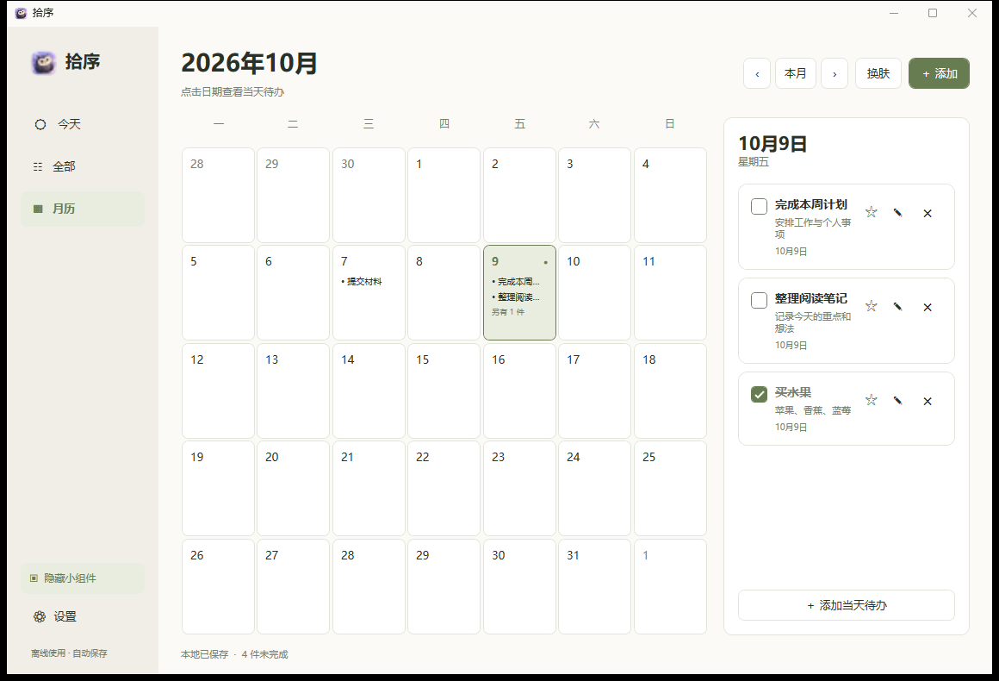
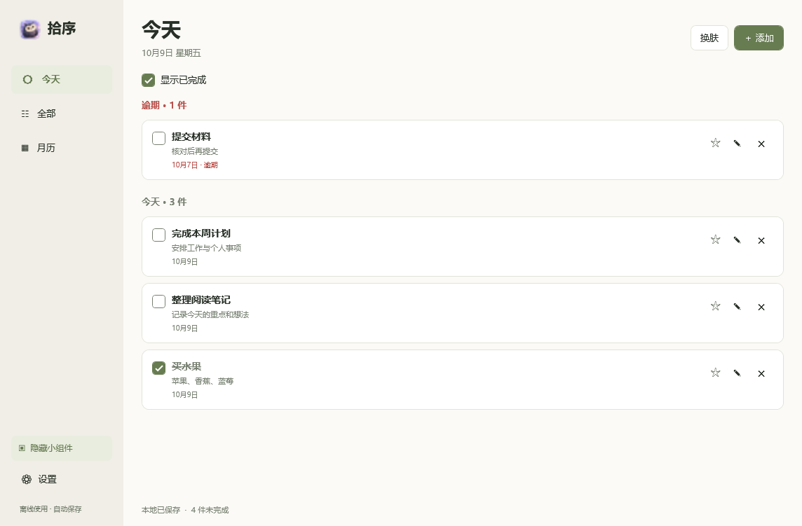
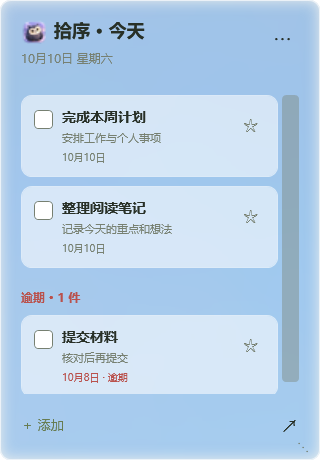
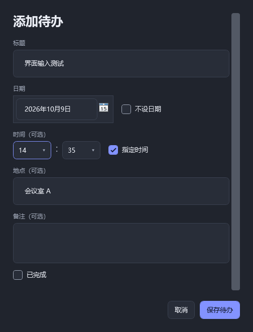
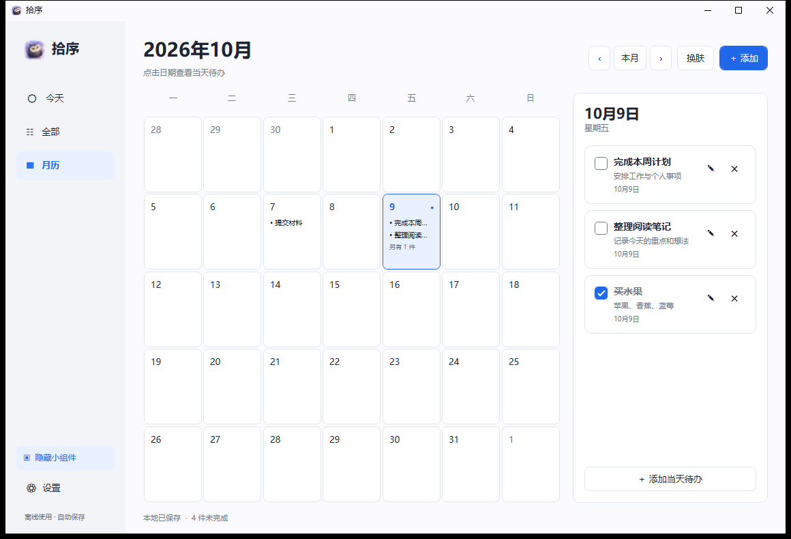
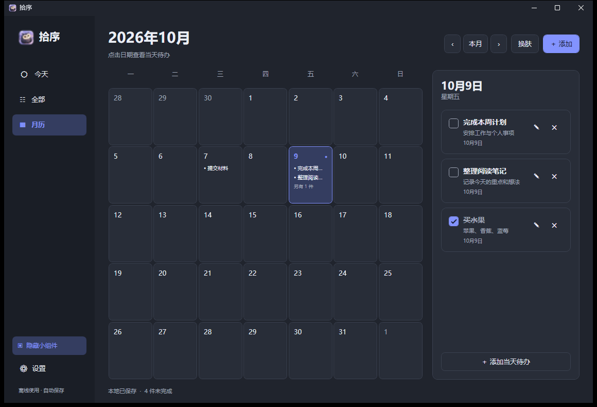

# 拾序 · Shixu


拾序是一款面向个人使用的 Windows 原生待办软件。用月历安排事情，用桌面小组件查看今天的任务；所有数据保存在本机，无需登录。

当前版本：**v1.3.2**。基于 **C# / WPF / .NET Framework 4.8**，便携运行，无第三方运行依赖。

[下载 Windows x64 便携版](https://github.com/XiongWen04/shixu/releases/latest) · [使用说明](docs/使用说明.md) · [版本记录](https://github.com/XiongWen04/shixu/releases)

## 界面预览

以下为 v1.3.2 实际运行截图，任务内容均为示例。日期随截图时的系统日期显示。

### 用月历安排一个月

点击日期，在右侧查看当天任务；切换月份安排后续事项，已完成的任务保留完成标记。



### 今天要做的事

“今天”集中展示当天及逾期事项，不设日期的任务可在“全部”中管理。



### 桌面上随时查看

关闭主窗口后，小组件仍可留在桌面。拖动顶部自由摆放、拖动右下角调整大小，也能直接完成任务或添加待办。左侧开关会显示“隐藏小组件”或“显示小组件”，开启时高亮。



组件采用模糊壁纸与半透明色层，实际效果随壁纸变化；它不置顶，自由摆放时可能遮挡桌面图标。

### 把时间和地点记清楚

标题必填，日期、时间、地点和备注按需要填写。时间使用 24 小时制，先设置日期再启用“指定时间”。



### 三套皮肤

通过“换肤”切换蓝白、暖色和深色；主窗口、小组件和弹窗同步配色，支持的系统上标题栏也随主题更新。

| 蓝白 | 暖色 | 深色 |
| --- | --- | --- |
|  |  |  |

## 功能

- 添加、编辑、删除待办，标记完成或恢复未完成，撤销最近一次删除。
- 可选日期、24 小时时间、地点和备注。
- 今天、全部及月历视图；点击日期查看和添加当天任务。
- 桌面小组件显示今天未完成及逾期事项，可直接完成或添加任务。
- 毛玻璃风格背景，顶部拖动自由摆放，右下角调整大小，记住位置。
- 蓝白、暖色和深色三套皮肤；标题栏同步配色。
- 小组件开关按钮显示当前操作，并随开关状态切换高亮。
- 自动保存、上一份有效备份、导入导出，以及自选数据保存目录。

时间用于安排和排序，暂不提供提醒通知、重复任务、账号、云同步或多人协作。

## 运行

推荐 Windows 11 64 位；Windows 10 64 位需已安装 .NET Framework 4.8。原生标题栏自定义配色依赖 Windows 11 的相关系统接口。

便携版解压后运行 `拾序.exe`，并保留旁边的 `拾序.exe.config`。关闭主窗口只会隐藏主窗口；彻底退出请在托盘菜单中选择“退出”。

从 [GitHub Releases](https://github.com/XiongWen04/shixu/releases/latest) 下载 `Shixu-v1.3.2-win-x64-portable.zip`。源码仓库本身不包含编译后的程序。仓库及 Release 已公开，可直接查看源码和下载附件。

### 第一次使用

1. 将便携包解压到有写入权限的文件夹，例如自己的文档目录；不要直接在压缩包中运行。
2. 双击 `拾序.exe`，点击“添加”或按 `Ctrl+N` 创建第一条任务。
3. 在“月历”点击具体日期，为当天安排任务；需要时填写时间和地点。
4. 打开桌面小组件，把它拖到合适的位置。关闭主窗口后仍可通过小组件或托盘使用软件。
5. 在设置中选择数据保存目录，或导出 JSON 备份。

便携包不带预置待办和个人设置，首次运行会创建本地数据文件。当前提供便携版，不需要安装向导。

### 更新已有版本

从托盘退出旧版本，备份数据后将新版 `拾序.exe` 和 `拾序.exe.config` 放回原程序目录。保留原有 `Data/`、`preferences.json` 及其备份文件；如果数据存放在自选目录，也保留该目录。不要用首次运行的新目录覆盖已有数据。

详细操作见 [使用说明](docs/使用说明.md)。

## 从源码构建

在 Windows 上执行，构建前确认存在系统编译器：

```text
C:\Windows\Microsoft.NET\Framework64\v4.0.30319\csc.exe
```

在仓库根目录打开 Windows PowerShell：

```powershell
powershell -NoProfile -ExecutionPolicy Bypass -File .\src\Build.ps1
```

输出位于 `dist\拾序\`，包含 `拾序.exe` 和配置文件。无需安装 Node.js、Python 或 NuGet 包。

构建并执行核心检查：

```powershell
powershell -NoProfile -ExecutionPolicy Bypass -File .\src\Build.ps1 -TestRoot .\test-results
```

核心检查覆盖日期与时分校验、旧数据兼容、导入导出、原子保存、备份恢复、文件锁和迁移失败保护。

界面检查需交互式 Windows 桌面，会短暂打开测试窗口，仅向指定测试目录写入示例任务：

```powershell
$testPath = Join-Path $PWD 'test-results\ui'
New-Item -ItemType Directory -Path $testPath -Force | Out-Null
$run = Start-Process -FilePath '.\dist\拾序\拾序.exe' -ArgumentList @('--ui-test', ('"' + $testPath + '"')) -PassThru
$run.WaitForExit()
Get-Content -LiteralPath (Join-Path $testPath 'ui-report.txt')
```

界面检查应使用新的空测试目录，避免把已有测试任务再次加载。不要将测试目录指向实际待办数据目录。自动界面检查不能替代不同 Windows 环境中的实际使用验证。

## 数据与备份

默认数据位于程序旁的 `Data\tasks.json`；设置保存在 `preferences.json`。在设置中可以选择其他数据目录，迁移时保留原数据。

保存使用临时文件及原子替换，并保留 `tasks.json.bak`。读取失败不会把损坏文件当成空清单覆盖。导入会校验文件，并在替换前要求确认。

支持读取旧格式 v1 和当前格式 v2，修改后保存为 v2。已有 v2 数据应使用当前或更新版本管理。

个人数据、设置、备份、编译结果和开发临时目录均由 `.gitignore` 排除。**不要把整个运行目录或个人数据手动拖入 GitHub 上传页面。**

## 目录

```text
.
├── README.md
├── .gitignore
├── .gitattributes
├── src/                # 源码、图标、样式、构建与检查代码
├── docs/               # 使用说明
├── dist/               # 构建输出，忽略
├── test-results/       # 检查结果，忽略
├── outputs/            # 本机程序与交付文件，忽略
└── work/               # 本机历史备份与临时内容，忽略
```

`outputs/` 和 `work/` 是本机保留目录，不属于公开源码。新克隆的仓库不会包含它们。

`docs/screenshots/` 保存 README 使用的示例界面截图。Release 的便携包只包含可执行文件、运行配置和使用说明，源码通过本仓库下载。

## 常见问题

**关闭窗口后为什么还在运行？** 主窗口关闭会隐藏到后台，让桌面小组件继续工作。要彻底退出，请使用系统托盘中的“退出”。

**指定时间会弹出提醒吗？** 当前不会。时间用于记录和排序，尚未实现闹钟或系统通知。

**小组件找不到了？** 在设置或托盘菜单中使用“找回小组件”；也可以通过左侧按钮重新显示。

**数据保存在哪里？** 默认在程序旁的 `Data/tasks.json`，可在设置中查看、打开或更换保存目录。设置文件为程序旁的 `preferences.json`。

**导入备份会合并任务吗？** 不会。导入在校验并确认后替换当前清单，建议先导出当前数据。

**便携包能直接放到 U 盘吗？** 可以放在可写目录中运行。移动程序前请退出；如果使用了自选数据路径，移动程序不会自动移动那里的数据。

## 实现说明与限制

- `Core.cs`：数据结构、校验、JSON 持久化、备份与迁移。
- `App.cs`：应用生命周期、共享状态、主题与托盘。
- `MainWindow.cs`、`Ui.cs`：主界面、待办编辑与设置。
- `WidgetWindow.cs`、`WidgetSurface.cs`：桌面小组件、拖动与壁纸模糊背景。
- `NativeDesktop.cs`：桌面所有者绑定、窗口层级及标题栏配色。
- `CoreTests.cs`、`UiSmoke.cs`：核心与界面检查。

小组件保持非置顶，并允许自由摆放；与桌面图标重叠时可能遮挡图标，不自动避让。毛玻璃使用模糊桌面壁纸与半透明色层，目前按“填充”布局映射；其他布局、多屏不同壁纸可能出现背景对齐差异。

桌面接入依赖 Explorer 窗口结构，未来系统更新或第三方桌面工具可能影响行为。未逐一验证所有 Windows 版本、多屏/DPI 组合或 Explorer 重启场景。

## 图标与许可

小猫头鹰图标为本项目经 AI 辅助生成并选定的视觉资源，源图及多尺寸 ICO 位于 `src/`。

目前尚未指定开源许可证。公开上传代码不等于授予开源使用、修改或分发许可；如果希望开放这些权限，请由项目维护者选择并添加相应 `LICENSE`。
